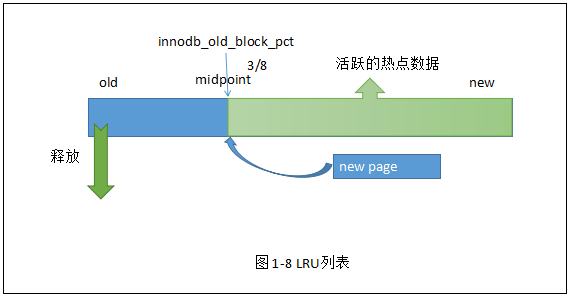

## Innodb体系架构
#### innodb对应mysql版本说明
### 一、innodb体系架构图

### 二、后台线程
*** 
#### 【1】Master Thread
 Master Thread主要是针对将缓冲区里的脏页刷新、redo log写入磁盘、合并insert buffer、回收 undo页等一类操作。
#### 【2】IO Thread
在innodb中为了提高Io的效率，使用了Aio的方式进行，分别提供了四种Io线程的类别，他们分别是write、read、log
和insert buffer thread。可以通过innodb_read_io_threads和innodb_write_io_threads进行设置，默认数量
是四个。
```
mysql> show variables like 'innodb_%Threadio_threads';
+-------------------------+-------+
| Variable_name           | Value |
+-------------------------+-------+
| innodb_read_io_threads  | 4     |
| innodb_write_io_threads | 4     |
+-------------------------+-------+

```
使用show engine innodb status可以查看到io的情况。

```
mysql>show engine innodb status
--------
FILE I/O
--------
I/O thread 0 state: waiting for completed aio requests (insert buffer thread)
I/O thread 1 state: waiting for completed aio requests (log thread)
I/O thread 2 state: waiting for completed aio requests (read thread)
I/O thread 3 state: waiting for completed aio requests (read thread)
I/O thread 4 state: waiting for completed aio requests (read thread)
I/O thread 5 state: waiting for completed aio requests (read thread)
I/O thread 6 state: waiting for completed aio requests (write thread)
I/O thread 7 state: waiting for completed aio requests (write thread)
I/O thread 8 state: waiting for completed aio requests (write thread)
I/O thread 9 state: waiting for completed aio requests (write thread)
Pending normal aio reads: [0, 0, 0, 0] , aio writes: [0, 0, 0, 0] ,
 ibuf aio reads:, log i/o's:, sync i/o's:
Pending flushes (fsync) log: 0; buffer pool: 0
91712610 OS file reads, 6355572 OS file writes, 999323 OS fsyncs
0.00 reads/s, 0 avg bytes/read, 0.00 writes/s, 0.00 fsyncs/s

```
#### 【3】Purge Thread
purge thread主要是用于回收当事务提交之后已经没有用处的undolog。用户可以通过innodb_purge_threads
进行设置，在innodb1.1中最多可以设置为1，之后可以进行多个线程的设置。
```
mysql> show variables like 'innodb_purge_threads';
+----------------------+-------+
| Variable_name        | Value |
+----------------------+-------+
| innodb_purge_threads | 4     |
+----------------------+-------+
```

#### 【4】Page Cleaner Thread
page Cleaner Thread主要的作用是用于对数据库脏页的刷新工作。
### 三、内存

#### 【1】缓冲池

缓冲池的作用：
* 当进行读取页操作中先将页数据从磁盘读取到缓冲池中，下次利于快速读取。
* 通过checkPoint技术将数据按一定频率刷进磁盘。

1. 可以通过innodb_buffer_pool_size进行数据缓冲池大小的设定，缓冲池允许存在多个实例.
2. 可以通过使用innodb_buffer_pool_instances实例数的设置，不同页通过hash分布在不同实例上。
3. 可以使用select pool_id,pool_size,free_buffers,database_pages from innodb_buffer_pool_stats;,查看到不同实例的使用情况
```
mysql> show variables like 'innodb_buffer_pool_size';
+-------------------------+-----------+
| Variable_name           | Value     |
+-------------------------+-----------+
| innodb_buffer_pool_size | 134217728 |
+-------------------------+-----------+

mysql> show variables like 'innodb_buffer_pool_instances';
+------------------------------+-------+
| Variable_name                | Value |
+------------------------------+-------+
| innodb_buffer_pool_instances | 1     |
+------------------------------+-------+

mysql> select pool_id,pool_size,free_buffers,database_pages from innodb_buffer_pool_stats;
+---------+-----------+--------------+----------------+
| pool_id | pool_size | free_buffers | database_pages |
+---------+-----------+--------------+----------------+
|       0 |      8191 |         1024 |           7066 |
+---------+-----------+--------------+----------------+
```
#### 【2】LRU LIST、ZIPLRU LIST、FREE LIST、FLUSH 
##### LRU LIST
在缓冲池里放着很大的一部分内存，innnodb则是使用LRU算法对这些区域进行管理的，与传统的LRU算法不同，
相较于将热点页放在列表前端、将少用的页放在页的后端。而innodb在lru列表上设置了一个midpoint，
新的页读取到先放在midpoint的位置，mid之前成为new list，之后称为old list，只有在在mid之后经过一段时间
之后再次读取才能将其移动至new list。使用如下两个参数对其进行控制，分别是innodb_old_blocks_pct来控制old list
占整个list的百分比，用innodb_old_blocks_item来控制从old list到new list必须等待的时间。</br>

##### FREE LIST
在一开始LRU LIST是没有页来展示的，只有通过FREE LIST将这些空白的页管理起来，当需要将页加入到LRU LIST，首先是通过去遍历FREE LIST
中是否有空白页，然后通过从FREE LIST中取出，添加到mid的位置，若没有空白就需要淘汰LRU末尾的页。
##### 
#### 【3】重写日志缓存
#### 【4】额外内存池

