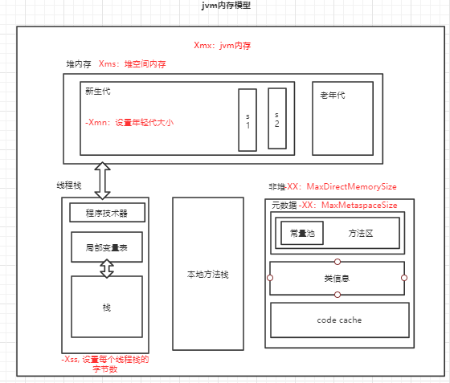
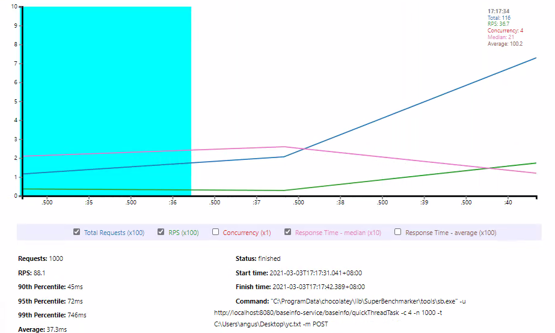
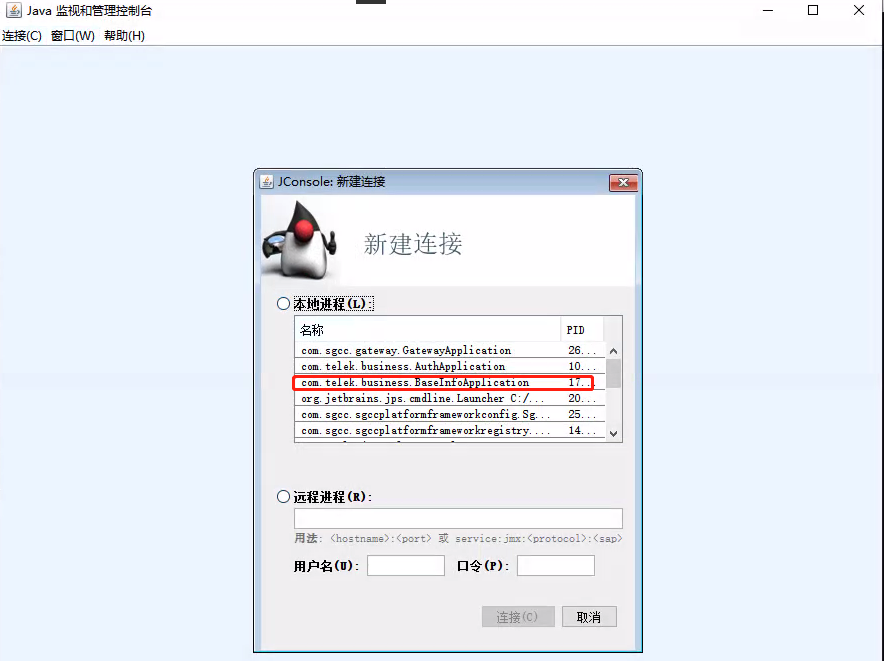
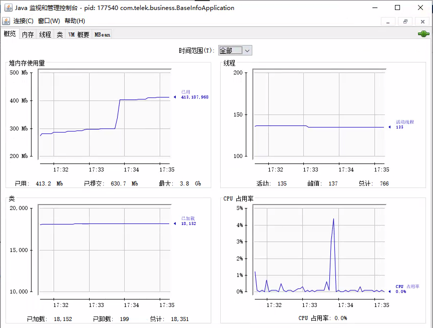
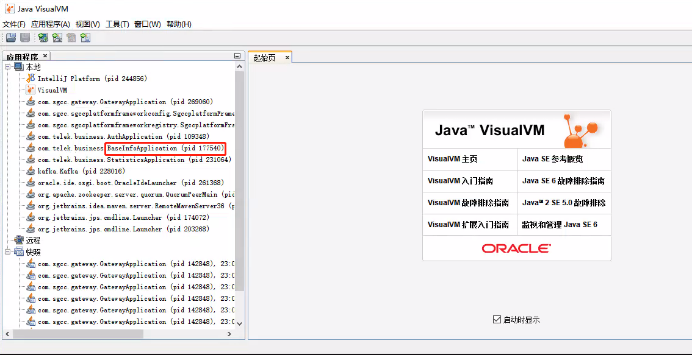
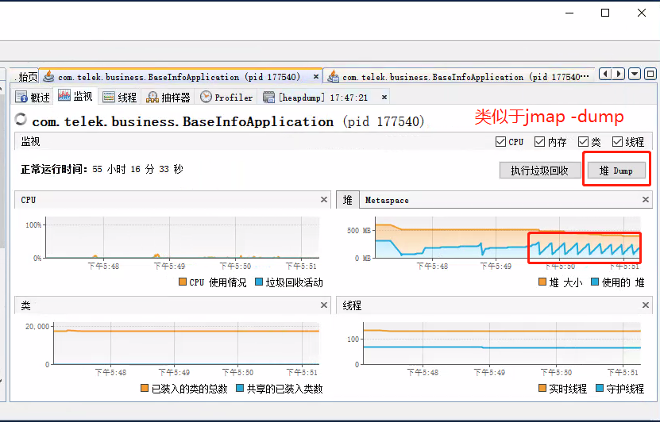
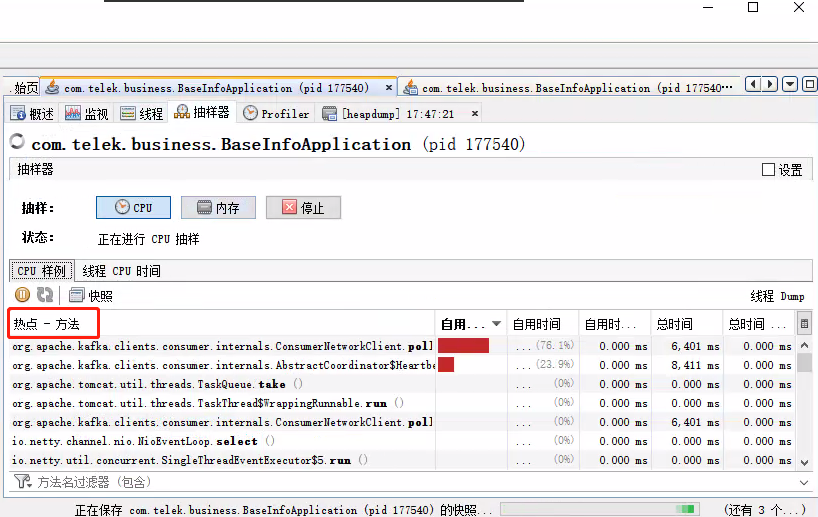
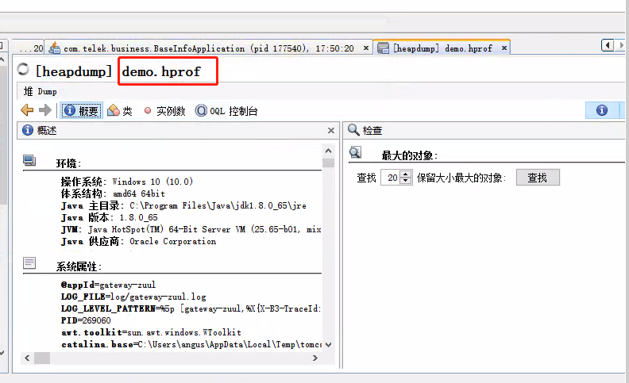

### java分析
#### 一、java内存模型
*** 
##### 简单描述
&nbsp;&nbsp;基于java性能问题或者一些系统问题排查，主要的排查手段是通过对jvm内存进行分析，如下是我画的关于简易的jvm内存模型。</br>
</br>
&nbsp;&nbsp;由于我们日常项目中主要是对Java堆内存、栈内存进行分析，堆中重要是存放的Java对象，可以同比理解为电网基建项目信息是存储在堆中的。
栈中主要是用来进行操作使用的，可以理解为将电网基建的数据获取并进行一些计算。堆内存是线程共享的，可以理解为电网基建对于省公司和国网
公司来说都可以共操作的，栈是线程私有的，可以理解为省公司和国网有着不同的操作。

##### 简单参数描述
&nbsp;&nbsp;根据上面的内存模型的讲解，对于这两个区域他的内存大小对于系统性能是至关重要的。下面提供一些简单的参数，可以对应上图中判断
参数的作用的区域。对应于系统的启动脚本，也可以去查看一下start.sh中进行查看,或进行相关配置。
```
//一些关于堆栈内存的简单启动参数
//设置JVM堆最小内存促使内存为512m。此值可以设置与-Xmx相同，以避免每次垃圾回收完成后JVM重新分配内存。
-Xms512m  
//设置JVM堆最大可用内存为512M
-Xmx512m ，
//设置年轻代大小为200M。
-Xmn200m：
//设置每个线程的堆栈大小。
-Xss128k：

```
根据上面的参数就可以对精准投资开发环境非刷数的启动脚本参数进行分析
```
//可以看见总共给jvm堆最大配置了20g,最小也是20g，元数据配置了4g。
java -server -d64 -Xmx20g -Xms20g -XX:MetaspaceSize=4g -XX:MaxMetaspaceSize=4g 
-XX:+UseAdaptiveSizePolicy -XX:+UseG1GC -XX:MaxGCPauseMillis=400 -XX:G1ReservePercent=30 
-XX:InitiatingHeapOccupancyPercent=60 -XX:ConcGCThreads=6 -XX:+UnlockCommercialFeatures 
-XX:+FlightRecorder -XX:+UseGCLogFileRotation -XX:NumberOfGCLogFiles=1 -XX:GCLogFileSize=50M -verbose:gc 
-XX:-OmitStackTraceInFastThrow -XX:ErrorFile=./hs_err_%pjvm.log  
-XX:+PrintGCDateStamps -XX:+PrintGCDetails -XX:+PrintGCApplicationStoppedTime -XX:+PrintGCApplicationConcurrentTime 
-XX:+PrintSafepointStatistics -XX:PrintSafepointStatisticsCount=1 -Xloggc:./gclogsjvm.log -XX:+UnlockDiagnosticVMOptions 
-XX:-DisplayVMOutput -XX:+LogVMOutput -XX:LogFile=./vmjvm.log   -jar SGCCPlatform-framework-boost-1.0.0jvm.jar
```

##### 通过简单案例描述
&nbsp;&nbsp;上面的一些分享可能不能让大家明白到底这些参数有什么大的用途，或者说这些参数对系统的运行效率
有什么实际的作用和帮助。下面通过一个简单的案例进行讲解。如下提供一个程序，程序的大概意思就是在一秒钟内一直创建对象，
对象的大小通过随机数控制。可以类比为一秒钟一直在获取电网基建对象。我们通过配置不同的堆大小进行分析，运用jdk1.8默认的
并行GC，不做垃圾回收器的讨论。

```
直接进入老年代扩展（利于看懂下面的程序）：
1、分配的对象大小大于eden space。适合所有收集器。
2、eden space剩余空间不足分配，且需要分配对象内存大小不小于eden space总空间的一半，
直接分配到老年代，不触发Minor GC。适合-XX:+UseParallelGC、-XX:+UseParallelOldGC，即适合Parallel Scavenge。
3、大对象直接进入老年代，使用-XX:PretenureSizeThreshold参数控制，
适合-XX:+UseSerialGC、-XX:+UseParNewGC、-XX:+UseConcMarkSweepGC，即适合Serial和ParNew收集器。

```

```java

import java.util.Random;
import java.util.concurrent.TimeUnit;
import java.util.concurrent.atomic.LongAdder;
/*
演示GC日志生成与解读
*/
public class GCLogAnalysis {
    private static Random random = new Random();
    public static void main(String[] args) {
        // 当前毫秒时间戳
        long startMillis = System.currentTimeMillis();
        // 持续运行毫秒数; 可根据需要进行修改
        long timeoutMillis = TimeUnit.SECONDS.toMillis(1);
        // 结束时间戳
        long endMillis = startMillis + timeoutMillis;
        LongAdder counter = new LongAdder();
        System.out.println("正在执行...");
        // 缓存一部分对象; 进入老年代
        int cacheSize = 2000;
        Object[] cachedGarbage = new Object[cacheSize];
        // 在此时间范围内,持续循环
        while (System.currentTimeMillis() < endMillis) {
            // 生成垃圾对象
            Object garbage = generateGarbage(100*1024);
            counter.increment();
            int randomIndex = random.nextInt(2 * cacheSize);
            if (randomIndex < cacheSize) {
                cachedGarbage[randomIndex] = garbage;
            }
        }
        System.out.println("执行结束!共生成对象次数:" + counter.longValue());
    }

    // 生成对象
    private static Object generateGarbage(int max) {
        int randomSize = random.nextInt(max);
        int type = randomSize % 4;
        Object result = null;
        switch (type) {
            case 0:
                result = new int[randomSize];
                break;
            case 1:
                result = new byte[randomSize];
                break;
            case 2:
                result = new double[randomSize];
                break;
            default:
                StringBuilder builder = new StringBuilder();
                String randomString = "randomString-Anything";
                while (builder.length() < randomSize) {
                    builder.append(randomString);
                    builder.append(max);
                    builder.append(randomSize);
                }
                result = builder.toString();
                break;
        }
        return result;
    }
}
```
###### 配置 -Xmx128M -Xms128M进行配置
```
//为了演示出效果，使用-XX:+PrintGCTimeStamps -XX:+PrintGCDetails 对gc的情况分析
C:\Users\31665\Desktop\A9。GCLogAnalysis.java>java -Xmx128M -Xms128M -XX:+PrintGCDetails -XX:+PrintGCTimeStamps GCLogAnalysis
正在执行...
0.108: [GC (Allocation Failure) [PSYoungGen: 33159K->5112K(38400K)] 33159K->13243K(125952K), 0.0037967 secs] [Times: user=0.00 sys=0.00, real=0.00 secs]
0.123: [GC (Allocation Failure) [PSYoungGen: 38039K->5115K(38400K)] 46170K->24453K(125952K), 0.0042098 secs] [Times: user=0.00 sys=0.00, real=0.00 secs]
0.136: [GC (Allocation Failure) [PSYoungGen: 38395K->5116K(38400K)] 57733K->32777K(125952K), 0.0036072 secs] [Times: user=0.00 sys=0.00, real=0.00 secs]
0.145: [GC (Allocation Failure) [PSYoungGen: 38363K->5113K(38400K)] 66023K->42222K(125952K), 0.0039503 secs] [Times: user=0.11 sys=0.02, real=0.00 secs]
0.155: [GC (Allocation Failure) [PSYoungGen: 38354K->5103K(38400K)] 75464K->52668K(125952K), 0.0043818 secs] [Times: user=0.00 sys=0.00, real=0.00 secs]
0.165: [GC (Allocation Failure) [PSYoungGen: 37713K->5109K(19968K)] 85278K->61852K(107520K), 0.0040975 secs] [Times: user=0.00 sys=0.00, real=0.00 secs]
0.172: [GC (Allocation Failure) [PSYoungGen: 19890K->9447K(29184K)] 76632K->67398K(116736K), 0.0029247 secs] [Times: user=0.00 sys=0.00, real=0.00 secs]
0.178: [GC (Allocation Failure) [PSYoungGen: 24295K->12285K(29184K)] 82246K->72097K(116736K), 0.0037076 secs] [Times: user=0.11 sys=0.00, real=0.00 secs]
0.185: [GC (Allocation Failure) [PSYoungGen: 27126K->14063K(29184K)] 86938K->75694K(116736K), 0.0035989 secs] [Times: user=0.00 sys=0.00, real=0.00 secs]
0.191: [GC (Allocation Failure) [PSYoungGen: 28880K->11230K(29184K)] 90512K->82987K(116736K), 0.0046014 secs] [Times: user=0.02 sys=0.00, real=0.01 secs]
0.198: [GC (Allocation Failure) [PSYoungGen: 25964K->5481K(29184K)] 97721K->87812K(116736K), 0.0041095 secs] [Times: user=0.00 sys=0.00, real=0.01 secs]
0.202: [Full GC (Ergonomics) [PSYoungGen: 5481K->0K(29184K)] [ParOldGen: 82330K->78436K(87552K)] 87812K->78436K(116736K), [Metaspace: 2707K->2707K(1056768K)], 0.0173411 secs] [Times: user=0.13 sys=0.00, real=0.02 secs]
0.222: [Full GC (Ergonomics) [PSYoungGen: 14848K->0K(29184K)] [ParOldGen: 78436K->82833K(87552K)] 93284K->82833K(116736K), [Metaspace: 2707K->2707K(1056768K)], 0.0088297 secs] [Times: user=0.09 sys=0.01, real=0.01 secs]
0.235: [Full GC (Ergonomics) [PSYoungGen: 14789K->1282K(29184K)] [ParOldGen: 82833K->87299K(87552K)] 97623K->88582K(116736K), [Metaspace: 2707K->2707K(1056768K)], 0.0158870 secs] [Times: user=0.11 sys=0.00, real=0.02 secs]
0.254: [Full GC (Ergonomics) [PSYoungGen: 14389K->2835K(29184K)] [ParOldGen: 87299K->87460K(87552K)] 101688K->90296K(116736K), [Metaspace: 2707K->2707K(1056768K)], 0.0168355 secs] [Times: user=0.11 sys=0.00, real=0.02 secs]
0.273: [Full GC (Ergonomics) [PSYoungGen: 14848K->5277K(29184K)] [ParOldGen: 87460K->86665K(87552K)] 102308K->91943K(116736K), [Metaspace: 2707K->2707K(1056768K)], 0.0161756 secs] [Times: user=0.01 sys=0.00, real=0.02 secs]
0.291: [Full GC (Ergonomics) [PSYoungGen: 14663K->7476K(29184K)] [ParOldGen: 86665K->86596K(87552K)] 101329K->94073K(116736K), [Metaspace: 2707K->2707K(1056768K)], 0.0144316 secs] [Times: user=0.00 sys=0.00, real=0.01 secs]
0.307: [Full GC (Ergonomics) [PSYoungGen: 14722K->9149K(29184K)] [ParOldGen: 86596K->87067K(87552K)] 101319K->96216K(116736K), [Metaspace: 2707K->2707K(1056768K)], 0.0244607 secs] [Times: user=0.13 sys=0.00, real=0.02 secs]
0.334: [Full GC (Ergonomics) [PSYoungGen: 14823K->10201K(29184K)] [ParOldGen: 87067K->87124K(87552K)] 101890K->97326K(116736K), [Metaspace: 2707K->2707K(1056768K)], 0.0137301 secs] [Times: user=0.13 sys=0.00, real=0.01 secs]
0.349: [Full GC (Ergonomics) [PSYoungGen: 14788K->11282K(29184K)] [ParOldGen: 87124K->87124K(87552K)] 101912K->98407K(116736K), [Metaspace: 2707K->2707K(1056768K)], 0.0025733 secs] [Times: user=0.00 sys=0.00, real=0.00 secs]
0.352: [Full GC (Ergonomics) [PSYoungGen: 14835K->12921K(29184K)] [ParOldGen: 87124K->87459K(87552K)] 101959K->100381K(116736K), [Metaspace: 2707K->2707K(1056768K)], 0.0166583 secs] [Times: user=0.06 sys=0.00, real=0.02 secs]
0.369: [Full GC (Ergonomics) [PSYoungGen: 14760K->14217K(29184K)] [ParOldGen: 87459K->87459K(87552K)] 102219K->101676K(116736K), [Metaspace: 2707K->2707K(1056768K)], 0.0022154 secs] [Times: user=0.00 sys=0.00, real=0.00 secs]
0.372: [Full GC (Ergonomics) [PSYoungGen: 14848K->14739K(29184K)] [ParOldGen: 87459K->87459K(87552K)] 102307K->102198K(116736K), [Metaspace: 2707K->2707K(1056768K)], 0.0024058 secs] [Times: user=0.00 sys=0.00, real=0.00 secs]
0.374: [Full GC (Allocation Failure) [PSYoungGen: 14739K->14739K(29184K)] [ParOldGen: 87459K->87440K(87552K)] 102198K->102179K(116736K), [Metaspace: 2707K->2707K(1056768K)], 0.0158510 secs] [Times: user=0.13 sys=0.00, real=0.02 secs]
Exception in thread "main" java.lang.OutOfMemoryError: Java heap space
        at GCLogAnalysis.generateGarbage(GCLogAnalysis.java:47)
        at GCLogAnalysis.main(GCLogAnalysis.java:24)
Heap
 PSYoungGen      total 29184K, used 14848K [0x00000000fd580000, 0x0000000100000000, 0x0000000100000000)
  eden space 14848K, 100% used [0x00000000fd580000,0x00000000fe400000,0x00000000fe400000)
  from space 14336K, 0% used [0x00000000fe400000,0x00000000fe400000,0x00000000ff200000)
  to   space 14336K, 0% used [0x00000000ff200000,0x00000000ff200000,0x0000000100000000)
 ParOldGen       total 87552K, used 87440K [0x00000000f8000000, 0x00000000fd580000, 0x00000000fd580000)
  object space 87552K, 99% used [0x00000000f8000000,0x00000000fd564138,0x00000000fd580000)
 Metaspace       used 2738K, capacity 4486K, committed 4864K, reserved 1056768K
  class space    used 294K, capacity 386K, committed 512K, reserved 1048576K
```
&nbsp;&nbsp;先不过多阐述GC的问题，我们可以看出来将堆的参数设置为128M，jvm一直在进行垃圾回收，但是程序还没有运行完成，
堆的内存就被占满，此时报出java.lang.OutOfMemoryError: Java heap space错误。

###### 配置 -Xmx512M -Xms512M进行配置
```
C:\Users\31665\Desktop\A9。GCLogAnalysis.java>java -Xmx512M -Xms512M -XX:+PrintGCDetails -XX:+PrintGCTimeStamps GCLogAnalysis
正在执行...
0.172: [GC (Allocation Failure) [PSYoungGen: 131584K->21497K(153088K)] 131584K->43098K(502784K), 0.0122383 secs] [Times: user=0.00 sys=0.13, real=0.01 secs]
0.206: [GC (Allocation Failure) [PSYoungGen: 152864K->21497K(153088K)] 174466K->83276K(502784K), 0.0133962 secs] [Times: user=0.05 sys=0.08, real=0.01 secs]
0.240: [GC (Allocation Failure) [PSYoungGen: 152632K->21491K(153088K)] 214412K->125005K(502784K), 0.0130813 secs] [Times: user=0.08 sys=0.05, real=0.01 secs]
0.277: [GC (Allocation Failure) [PSYoungGen: 153075K->21503K(153088K)] 256589K->161238K(502784K), 0.0122180 secs] [Times: user=0.00 sys=0.00, real=0.01 secs]
0.310: [GC (Allocation Failure) [PSYoungGen: 153087K->21502K(153088K)] 292822K->205614K(502784K), 0.0133887 secs] [Times: user=0.01 sys=0.00, real=0.01 secs]
0.346: [GC (Allocation Failure) [PSYoungGen: 153086K->21499K(80384K)] 337198K->241033K(430080K), 0.0139126 secs] [Times: user=0.03 sys=0.08, real=0.01 secs]
0.369: [GC (Allocation Failure) [PSYoungGen: 80045K->33024K(116736K)] 299580K->258230K(466432K), 0.0073902 secs] [Times: user=0.11 sys=0.01, real=0.01 secs]
0.386: [GC (Allocation Failure) [PSYoungGen: 91904K->46430K(116736K)] 317110K->275771K(466432K), 0.0096899 secs] [Times: user=0.00 sys=0.00, real=0.01 secs]
0.406: [GC (Allocation Failure) [PSYoungGen: 104732K->56575K(116736K)] 334072K->295482K(466432K), 0.0125868 secs] [Times: user=0.05 sys=0.06, real=0.01 secs]
0.428: [GC (Allocation Failure) [PSYoungGen: 115362K->47267K(116736K)] 354269K->317653K(466432K), 0.0178251 secs] [Times: user=0.08 sys=0.03, real=0.02 secs]
0.458: [GC (Allocation Failure) [PSYoungGen: 106079K->23532K(116736K)] 376466K->336654K(466432K), 0.0135242 secs] [Times: user=0.06 sys=0.06, real=0.01 secs]
0.472: [Full GC (Ergonomics) [PSYoungGen: 23532K->0K(116736K)] [ParOldGen: 313121K->246834K(349696K)] 336654K->246834K(466432K), [Metaspace: 2707K->2707K(1056768K)], 0.0514659 secs] [Times: user=0.34 sys=0.00, real=0.05 secs]
0.535: [GC (Allocation Failure) [PSYoungGen: 58569K->19528K(116736K)] 305403K->266362K(466432K), 0.0050538 secs] [Times: user=0.00 sys=0.00, real=0.01 secs]
0.550: [GC (Allocation Failure) [PSYoungGen: 78408K->22391K(116736K)] 325242K->285649K(466432K), 0.0070562 secs] [Times: user=0.00 sys=0.00, real=0.01 secs]
0.569: [GC (Allocation Failure) [PSYoungGen: 81271K->19345K(116736K)] 344529K->304974K(466432K), 0.0078099 secs] [Times: user=0.13 sys=0.00, real=0.01 secs]
0.587: [GC (Allocation Failure) [PSYoungGen: 78225K->23279K(116736K)] 363854K->326853K(466432K), 0.0090546 secs] [Times: user=0.11 sys=0.00, real=0.01 secs]
0.596: [Full GC (Ergonomics) [PSYoungGen: 23279K->0K(116736K)] [ParOldGen: 303573K->277504K(349696K)] 326853K->277504K(466432K), [Metaspace: 2707K->2707K(1056768K)], 0.0562100 secs] [Times: user=0.28 sys=0.02, real=0.06 secs]
0.667: [GC (Allocation Failure) [PSYoungGen: 58880K->18960K(116736K)] 336384K->296465K(466432K), 0.0043029 secs] [Times: user=0.00 sys=0.00, real=0.00 secs]
0.684: [GC (Allocation Failure) [PSYoungGen: 77840K->23480K(116736K)] 355345K->318017K(466432K), 0.0080523 secs] [Times: user=0.00 sys=0.00, real=0.01 secs]
0.703: [GC (Allocation Failure) [PSYoungGen: 82311K->24536K(116736K)] 376847K->341592K(466432K), 0.0091498 secs] [Times: user=0.00 sys=0.00, real=0.01 secs]
0.712: [Full GC (Ergonomics) [PSYoungGen: 24536K->0K(116736K)] [ParOldGen: 317055K->292211K(349696K)] 341592K->292211K(466432K), [Metaspace: 2707K->2707K(1056768K)], 0.0534732 secs] [Times: user=0.34 sys=0.00, real=0.05 secs]
0.780: [GC (Allocation Failure) [PSYoungGen: 58880K->22897K(116736K)] 351091K->315109K(466432K), 0.0049565 secs] [Times: user=0.00 sys=0.00, real=0.00 secs]
0.797: [GC (Allocation Failure) [PSYoungGen: 81777K->23337K(116736K)] 373989K->337524K(466432K), 0.0092243 secs] [Times: user=0.00 sys=0.00, real=0.01 secs]
0.806: [Full GC (Ergonomics) [PSYoungGen: 23337K->0K(116736K)] [ParOldGen: 314186K->299653K(349696K)] 337524K->299653K(466432K), [Metaspace: 2707K->2707K(1056768K)], 0.0575892 secs] [Times: user=0.33 sys=0.00, real=0.06 secs]
0.876: [GC (Allocation Failure) [PSYoungGen: 58624K->17810K(116736K)] 358278K->317464K(466432K), 0.0036491 secs] [Times: user=0.00 sys=0.00, real=0.00 secs]
0.891: [GC (Allocation Failure) [PSYoungGen: 76690K->16528K(116736K)] 376344K->333234K(466432K), 0.0061587 secs] [Times: user=0.00 sys=0.00, real=0.01 secs]
0.898: [Full GC (Ergonomics) [PSYoungGen: 16528K->0K(116736K)] [ParOldGen: 316705K->302123K(349696K)] 333234K->302123K(466432K), [Metaspace: 2707K->2707K(1056768K)], 0.0550635 secs] [Times: user=0.42 sys=0.00, real=0.06 secs]
0.965: [GC (Allocation Failure) [PSYoungGen: 58396K->21601K(116736K)] 360519K->323724K(466432K), 0.0060963 secs] [Times: user=0.00 sys=0.00, real=0.01 secs]
0.982: [GC (Allocation Failure) [PSYoungGen: 80481K->22093K(116736K)] 382604K->345100K(466432K), 0.0112563 secs] [Times: user=0.00 sys=0.00, real=0.01 secs]
0.993: [Full GC (Ergonomics) [PSYoungGen: 22093K->0K(116736K)] [ParOldGen: 323006K->311998K(349696K)] 345100K->311998K(466432K), [Metaspace: 2707K->2707K(1056768K)], 0.0622035 secs] [Times: user=0.45 sys=0.00, real=0.06 secs]
1.073: [GC (Allocation Failure) [PSYoungGen: 58880K->19030K(116736K)] 370878K->331029K(466432K), 0.0043431 secs] [Times: user=0.13 sys=0.00, real=0.00 secs]
执行结束!共生成对象次数:7309
Heap
 PSYoungGen      total 116736K, used 41159K [0x00000000f5580000, 0x0000000100000000, 0x0000000100000000)
  eden space 58880K, 37% used [0x00000000f5580000,0x00000000f6b1c620,0x00000000f8f00000)
  from space 57856K, 32% used [0x00000000f8f00000,0x00000000fa1958f0,0x00000000fc780000)
  to   space 57856K, 0% used [0x00000000fc780000,0x00000000fc780000,0x0000000100000000)
 ParOldGen       total 349696K, used 311998K [0x00000000e0000000, 0x00000000f5580000, 0x00000000f5580000)
  object space 349696K, 89% used [0x00000000e0000000,0x00000000f30afb80,0x00000000f5580000)
 Metaspace       used 2714K, capacity 4486K, committed 4864K, reserved 1056768K
  class space    used 291K, capacity 386K, committed 512K, reserved 1048576K
```
&nbsp;&nbsp;我们将其分配为512M时，就没有报错程序正常运行，共生成对象次数:7309，也就代表一秒钟循环了7309次，
内存增大所能容纳的对象数变大，所以能正常进行。

###### 配置 -Xmx1G -Xms1G进行配置
```
C:\Users\31665\Desktop\A9。GCLogAnalysis.java>java -Xmx1G -Xms1G -XX:+PrintGCDetails -XX:+PrintGCTimeStamps GCLogAnalysis
正在执行...
0.244: [GC (Allocation Failure) [PSYoungGen: 262144K->43509K(305664K)] 262144K->76643K(1005056K), 0.0159359 secs] [Times: user=0.05 sys=0.08, real=0.02 secs]
0.302: [GC (Allocation Failure) [PSYoungGen: 305653K->43513K(305664K)] 338787K->154888K(1005056K), 0.0292454 secs] [Times: user=0.16 sys=0.09, real=0.03 secs]
0.375: [GC (Allocation Failure) [PSYoungGen: 305657K->43514K(305664K)] 417032K->226547K(1005056K), 0.0258602 secs] [Times: user=0.06 sys=0.08, real=0.03 secs]
0.443: [GC (Allocation Failure) [PSYoungGen: 305658K->43510K(305664K)] 488691K->297936K(1005056K), 0.0238532 secs] [Times: user=0.17 sys=0.06, real=0.02 secs]
0.507: [GC (Allocation Failure) [PSYoungGen: 305654K->43512K(305664K)] 560080K->373998K(1005056K), 0.0255271 secs] [Times: user=0.05 sys=0.08, real=0.03 secs]
0.572: [GC (Allocation Failure) [PSYoungGen: 305546K->43513K(160256K)] 636031K->442916K(859648K), 0.0311166 secs] [Times: user=0.03 sys=0.06, real=0.03 secs]
0.620: [GC (Allocation Failure) [PSYoungGen: 160115K->70548K(232960K)] 559518K->476584K(932352K), 0.0147102 secs] [Times: user=0.13 sys=0.00, real=0.01 secs]
0.655: [GC (Allocation Failure) [PSYoungGen: 187172K->94966K(232960K)] 593207K->508201K(932352K), 0.0220278 secs] [Times: user=0.11 sys=0.02, real=0.02 secs]
0.699: [GC (Allocation Failure) [PSYoungGen: 211702K->107418K(232960K)] 624937K->541247K(932352K), 0.0251162 secs] [Times: user=0.13 sys=0.00, real=0.02 secs]
0.746: [GC (Allocation Failure) [PSYoungGen: 224154K->69051K(232960K)] 657983K->562415K(932352K), 0.0295650 secs] [Times: user=0.13 sys=0.11, real=0.03 secs]
0.795: [GC (Allocation Failure) [PSYoungGen: 185787K->35765K(232960K)] 679151K->592179K(932352K), 0.0275374 secs] [Times: user=0.14 sys=0.03, real=0.03 secs]
0.840: [GC (Allocation Failure) [PSYoungGen: 152501K->47278K(232960K)] 708915K->635520K(932352K), 0.0176347 secs] [Times: user=0.00 sys=0.11, real=0.02 secs]
0.875: [GC (Allocation Failure) [PSYoungGen: 163894K->44219K(232960K)] 752136K->675658K(932352K), 0.0194962 secs] [Times: user=0.05 sys=0.06, real=0.02 secs]
0.895: [Full GC (Ergonomics) [PSYoungGen: 44219K->0K(232960K)] [ParOldGen: 631438K->343672K(699392K)] 675658K->343672K(932352K), [Metaspace: 2707K->2707K(1056768K)], 0.0801213 secs] [Times: user=0.53 sys=0.05, real=0.08 secs]
0.996: [GC (Allocation Failure) [PSYoungGen: 116736K->40833K(232960K)] 460408K->384505K(932352K), 0.0088421 secs] [Times: user=0.00 sys=0.00, real=0.01 secs]
1.026: [GC (Allocation Failure) [PSYoungGen: 157569K->36908K(232960K)] 501241K->416405K(932352K), 0.0129414 secs] [Times: user=0.00 sys=0.00, real=0.01 secs]
1.062: [GC (Allocation Failure) [PSYoungGen: 153318K->39071K(232960K)] 532815K->451072K(932352K), 0.0142458 secs] [Times: user=0.11 sys=0.00, real=0.01 secs]
执行结束!共生成对象次数:10480
Heap
 PSYoungGen      total 232960K, used 106615K [0x00000000eab00000, 0x0000000100000000, 0x0000000100000000)
  eden space 116736K, 57% used [0x00000000eab00000,0x00000000eecf60d0,0x00000000f1d00000)
  from space 116224K, 33% used [0x00000000f8e80000,0x00000000fb4a7da8,0x0000000100000000)
  to   space 116224K, 0% used [0x00000000f1d00000,0x00000000f1d00000,0x00000000f8e80000)
 ParOldGen       total 699392K, used 412001K [0x00000000c0000000, 0x00000000eab00000, 0x00000000eab00000)
  object space 699392K, 58% used [0x00000000c0000000,0x00000000d92584a8,0x00000000eab00000)
 Metaspace       used 2714K, capacity 4486K, committed 4864K, reserved 1056768K
  class space    used 291K, capacity 386K, committed 512K, reserved 1048576K
```
&nbsp;&nbsp;我们能明显感受到日志数量变少，间接说明了此时jvm的gc操作明显变少，使得共生成对象次数:10480，
让程序的效率变得更高，但是需要思考的是是不是这些参数越大越好，对于这样一个小程序来说可能会表现出这样。但是如果
是一个较大的需要实时性极高的程序，如果内存变大gc的时间也必然增长，所以必须综合考虑其中的利弊进行抉择。

#### 二、简单命令的使用
*** 
##### jps命令
&nbsp;&nbsp;通常在linux下我们使用ps命令进行运行的进程进行，jdk中也有相对应的命令进行查询jvm下进行的进程
主要通过如下命令进行使用查询。
* -m 输出传递给main方法的参数，在嵌入式jvm上可能是null
* -l 输出应用程序main class的完整package名或者应用程序的jar文件完整路径名
* -v 输出传递给JVM的参数,例如之前提到的Xmx和Xms

```
//可以查看到左侧为pid 右侧为进程名称
C:\Users\angus>jps
269060 GatewayApplication
109348 AuthApplication
177540 BaseInfoApplication
203268 Launcher
256616 SgccplatformFrameworkConfigApplication
143696 SgccplatformFrameworkRegistryApplication
228016 Kafka
26932 Jps
92852 RemoteMavenServer36
174072 Launcher
231064 StatisticsApplication
244856
261368 OracleIdeLauncher
228444 QuorumPeerMain

//如果想查看详细信息
C:\Users\angus>jps -l
269060 com.sgcc.gateway.GatewayApplication
109348 com.telek.business.AuthApplication
155620 sun.tools.jps.Jps
177540 com.telek.business.BaseInfoApplication
203268 org.jetbrains.jps.cmdline.Launcher
256616 com.sgcc.sgccplatformframeworkconfig.SgccplatformFrameworkConfigApplication
143696 com.sgcc.sgccplatformframeworkregistry.SgccplatformFrameworkRegistryApplication
228016 kafka.Kafka
92852 org.jetbrains.idea.maven.server.RemoteMavenServer36
174072 org.jetbrains.jps.cmdline.Launcher
231064 com.telek.business.StatisticsApplication
244856
261368 oracle.ide.osgi.boot.OracleIdeLauncher
228444 org.apache.zookeeper.server.quorum.QuorumPeerMain

```
##### jinfo命令
&nbsp;&nbsp;jps -v查看到的命令相对来说是针对于整个参数，但是如果想查看默认参数或者某个特定参数就需要使用到jinfo
命令，主要使用如下：
```
//【1】对于进程完成信息查询jinfo pid，数据过多在这里就不进行展示了

//【2】对于某个参数查询 jinfo -flag [var] pid 
C:\Users\angus>jinfo -flag ConcGCThreads 269060
-XX:ConcGCThreads=2

//【3】查看全部参数 jinfo -flags pid
C:\Users\angus>jinfo -flags 269060
Attaching to process ID 269060, please wait...
Debugger attached successfully.
Server compiler detected.
JVM version is 25.65-b01
Non-default VM flags: -XX:-BytecodeVerificationLocal -XX:-BytecodeVerificationRemote -XX:CICompilerCount=3 -XX:ConcGCThreads=2 -XX:G1HeapRegionSize=1048576 -XX:InitialHeapSize=536870912 -XX:+ManagementServer -XX:MarkStackSize=4194304 -XX:MaxHeapSize=536870912 -XX:MaxNewSize=321912832 -XX:MinHeapDeltaBytes=1048576 -XX:TieredStopAtLevel=1 -XX:+UseCompressedClassPointers -XX:+UseCompressedOops -XX:+UseFastUnorderedTimeStamps -XX:+UseG1GC -XX:-UseLargePagesIndividualAllocation
Command line:  -agentlib:jdwp=transport=dt_socket,address=127.0.0.1:50417,suspend=y,server=n -Xms512m -Xmx512m -XX:+UseG1GC -XX:TieredStopAtLevel=1 -Xverify:none -Dspring.output.ansi.enabled=always -Dcom.sun.management.jmxremote -Dspring.jmx.enabled=true -Dspring.liveBeansView.mbeanDomain -Dspring.application.admin.enabled=true -javaagent:C:\Users\angus\.IntelliJIdea2019.3\system\captureAgent\debugger-agent.jar -Dfile.encoding=UTF-8

//【4】开启或者关闭对应名称的参数 jinfo -flag [+|-]name pid
C:\Users\angus>jinfo -flag +PrintGC 269060
C:\Users\angus>jinfo -flag PrintGC 269060
-XX:+PrintGC

//【5】改变某个参数jinfo -flag name=value pid
```
##### jstat命令
&nbsp;&nbsp;jstat可以用来查看一些内存的使用情况，或者类的使用情况
```
jstat [-命令选项] [pid] [间隔时间/毫秒] [查询次数]
命令选项：
-class 显示ClassLoad的相关信息；
-compiler 显示JIT编译的相关信息；
-gc 显示和gc相关的堆信息；
-gccapacity 　　 显示各个代的容量以及使用情况；
-gcmetacapacity 显示metaspace的大小
-gcnew 显示新生代信息；
-gcnewcapacity 显示新生代大小和使用情况；
-gcold 显示老年代和永久代的信息；
-gcoldcapacity 显示老年代的大小；
-gcutil　　 显示垃圾收集信息；
-gccause 显示垃圾回收的相关信息（通-gcutil）,同时显示最后一次或当前正在发生的垃圾回收的诱因；
-printcompilation 输出JIT编译的方法信息；
工作中主要使用到的是gc对垃圾回收，gcutil统计各个区域的百分比、class对使用类的情况进行分析

【1】利用gc参数对gc进行分析,
C结尾代表容量,U结尾代表使用，GC结尾代表GC次数，GCT结尾代表GC时间,Y代表young,F代表full
其他的按照首字母对应Survive区，Eden区，Old区,MateSpace区，CLASSCahce区
C:\Users\angus>jstat -gc 269060 1 3
 S0C    S1C    S0U    S1U      EC       EU        OC         OU       MC     MU    CCSC   CCSU   YGC     YGCT    FGC    FGCT     GCT
 0.0    0.0    0.0    0.0   330752.0 124928.0  193536.0   37232.5   68352.0 64452.6 9472.0 8709.2     10    0.400   1      0.206    0.606
 0.0    0.0    0.0    0.0   330752.0 124928.0  193536.0   37232.5   68352.0 64452.6 9472.0 8709.2     10    0.400   1      0.206    0.606
 0.0    0.0    0.0    0.0   330752.0 124928.0  193536.0   37232.5   68352.0 64452.6 9472.0 8709.2     10    0.400   1      0.206    0.606


【2】利用gcutil参数对gc进行分析,
C:\Users\angus>jstat -gcutil 269060 1 3
  S0     S1     E      O      M     CCS    YGC     YGCT    FGC    FGCT     GCT
  0.00   0.00  50.46  19.24  94.30  91.95     10    0.400     1    0.206    0.606
  0.00   0.00  50.46  19.24  94.30  91.95     10    0.400     1    0.206    0.606
  0.00   0.00  50.46  19.24  94.30  91.95     10    0.400     1    0.206    0.606 
```

##### jmap命令
&nbsp;&nbsp;jmap命令是一个可以输出所有内存中对象的工具，甚至可以将VM 中的heap，以二进制输出成文本。
打印出某个java进程（使用pid）内存内的，所有‘对象’的情况（如：产生那些对象，及其数量）。
```
【1】使用其对堆算法和情况的查看
C:\Users\angus>jmap -heap 269060
Attaching to process ID 269060, please wait...
Debugger attached successfully.
Server compiler detected.
JVM version is 25.65-b01

using thread-local object allocation.
//gc的使用的算法
Garbage-First (G1) GC with 6 thread(s)

//堆上数据的一些基本信息
Heap Configuration:
   MinHeapFreeRatio         = 40
   MaxHeapFreeRatio         = 70
   MaxHeapSize              = 536870912 (512.0MB)
   NewSize                  = 1363144 (1.2999954223632812MB)
   MaxNewSize               = 321912832 (307.0MB)
   OldSize                  = 5452592 (5.1999969482421875MB)
   NewRatio                 = 2
   SurvivorRatio            = 8
   MetaspaceSize            = 21807104 (20.796875MB)
   CompressedClassSpaceSize = 1073741824 (1024.0MB)
   MaxMetaspaceSize         = 17592186044415 MB
   G1HeapRegionSize         = 1048576 (1.0MB)

//堆上的使用情况
Heap Usage:
G1 Heap:
   regions  = 512
   capacity = 536870912 (512.0MB)
   used     = 269861384 (257.35987091064453MB)
   free     = 267009528 (254.64012908935547MB)
   50.26559978723526% used
G1 Young Generation:
Eden Space:
   regions  = 221
   capacity = 338690048 (323.0MB)
   used     = 231735296 (221.0MB)
   free     = 106954752 (102.0MB)
   68.42105263157895% used
Survivor Space:
   regions  = 0
   capacity = 0 (0.0MB)
   used     = 0 (0.0MB)
   free     = 0 (0.0MB)
   0.0% used
G1 Old Generation:
   regions  = 37
   capacity = 198180864 (189.0MB)
   used     = 38126088 (36.35987091064453MB)
   free     = 160054776 (152.64012908935547MB)
   19.238026936848957% used

28105 interned Strings occupying 3094824 bytes


【2】使用其对 -histo[:live] 打印每个class的实例数目,
内存占用,类全名信息. VM的内部类名字开头会加上前缀”*”. 
如果live子参数加上后,只统计活的对象数量. 

C:\Users\angus>jmap -histo:live 269060
数组表示：
[Z = boolean
[B = byte
[S = short
[I = int
[J = long
[F = float
[D = double
[C = char
[L = any non-primitives(Object)
数量排名   对象数量           对象总大小  对象类型
 num     #instances         #bytes  class name
----------------------------------------------
   1:         87655        8962856  [C
   2:         53311        4275880  [Ljava.lang.Object;
   3:        103793        3321376  java.lang.StackTraceElement
   4:         83865        2683680  java.util.concurrent.ConcurrentHashMap$Node
   5:         20320        2581656  [I
   6:         31877        2518048  [S
   7:         86861        2084664  java.lang.String
   8:         19037        1675256  java.lang.reflect.Method
   9:         14512        1607504  java.lang.Class
  10:         38288        1531520  java.util.LinkedHashMap$Entry
  11:          4832        1214048  [B
  12:         15997        1146600  [Ljava.util.HashMap$Node;
  13:           599        1122944  [Ljava.util.concurrent.ConcurrentHashMap$Node;
  14:         21451        1029648  org.aspectj.weaver.reflect.ShadowMatchImpl
  15:         17464         977984  java.util.LinkedHashMap
  
  【3】 -dump:[live,]format=b,file=<filename> 使用hprof二进制形式,
  输出jvm的heap内容到文件=.  live子选项是可选的，假如指定live选项,那么只输出活的对象到文件.
  之后可以使用jvm分析工具对堆dump文件进行分析。 
  
  扩展自动形成dump配置：
  1. -XX:+HeapDumpOnOutOfMemoryError 
  当OutOfMemoryError发生时自动生成 Heap Dump 文件。
  这是一个非常有用的参数，因为当你需要分析Java内存使用情况时，往往是在OOM(OutOfMemoryError)发生时。
  
  2. -XX:+HeapDumpBeforeFullGC 
  当 JVM 执行 FullGC 前执行 dump。
  
  3. -XX:+HeapDumpAfterFullGC 
  当 JVM 执行 FullGC 后执行 dump。
  
  4. -XX:+HeapDumpOnCtrlBreak 
  交互式获取dump。在控制台按下快捷键Ctrl + Break时，JVM就会转存一下堆快照。
  
  5. -XX:HeapDumpPath=d:\test.hprof 
  指定 dump 文件存储路径。
  
C:\Users\angus>jmap -dump:live,format=b,file=C:\Users\angus\Desktop\demo.hprof  269060
Dumping heap to C:\Users\angus\Desktop\demo.hprof ...
Heap dump file created
```

##### jstack命令
&nbsp;&nbsp jstack命令主要是使用线程的情况进行一系列的分析
* -F：当正常输出的请求不被响应时，强制输出线程堆栈。
* -l：除堆栈外，会打印出额外的锁信息，在发生死锁时可以用jstack -l pid来观察锁持有情况
* -m：如果调用到本地方法的话，可以显示C/C++的堆栈

【1】这个指令我们通过一个简单的死锁程序进行分析
```java
package com.angus.simpleAware;

/**
 * @author angus
 * @version 1.0.0
 * @ClassName DeadLockDemo.java
 * @Description 编写一个产生死锁的demo
 * @createTime 2021年02月24日 15:01:00
 */
public class DeadLockDemo {

    private static final Object A = new Object();
    private static final Object B = new Object();

    /**
     *
     * @param args
     */
    public static void main(String[] args) {

        DeadLockDemo deadLockDemo = new DeadLockDemo();

        new Thread(()->{deadLockDemo.method1();},"angus1").start();
        new Thread(()->{deadLockDemo.method2();},"angus2").start();


    }

    private void method1(){
        synchronized (DeadLockDemo.A){
            try {
                Thread.sleep(1000);
            } catch (InterruptedException e) {
                e.printStackTrace();
            }
            synchronized (DeadLockDemo.B){
                System.out.println("method1此处进行操作");
            }
        }
    }

    private void method2(){
        synchronized (DeadLockDemo.B){
            synchronized (DeadLockDemo.A){
                System.out.println("method2此处进行操作");
            }
        }
    }

}
```

&nbsp;&nbsp;对于基本的该程序我们使用jstack进行分析,如下面展示。可以展示出当前程序所存在的线程，并能展示线程目前的状态，
我们可以很明显的angus1和angus2都处于阻塞的情况，在最后也给出了检测出一处死锁，也正是这两个线程死锁。

```
Full thread dump Java HotSpot(TM) 64-Bit Server VM (25.261-b12 mixed mode):

"DestroyJavaVM" #14 prio=5 os_prio=0 tid=0x0000027c7cebe000 nid=0x5850 waiting on condition [0x0000000000000000]
   java.lang.Thread.State: RUNNABLE

   Locked ownable synchronizers:
        - None

"angus2" #13 prio=5 os_prio=0 tid=0x0000027c19c00000 nid=0x6dc4 waiting for monitor entry [0x0000007d458ff000]
   java.lang.Thread.State: BLOCKED (on object monitor)
        at com.angus.simpleAware.DeadLockDemo.method2(DeadLockDemo.java:46)
        - waiting to lock <0x000000076b623088> (a java.lang.Object)
        - locked <0x000000076b623098> (a java.lang.Object)
        at com.angus.simpleAware.DeadLockDemo.lambda$main$1(DeadLockDemo.java:24)
        at com.angus.simpleAware.DeadLockDemo$$Lambda$2/990368553.run(Unknown Source)
        at java.lang.Thread.run(Thread.java:748)

   Locked ownable synchronizers:
        - None

"angus1" #12 prio=5 os_prio=0 tid=0x0000027c19bfe800 nid=0x6db4 waiting for monitor entry [0x0000007d457ff000]
   java.lang.Thread.State: BLOCKED (on object monitor)
        at com.angus.simpleAware.DeadLockDemo.method1(DeadLockDemo.java:38)
        - waiting to lock <0x000000076b623098> (a java.lang.Object)
        - locked <0x000000076b623088> (a java.lang.Object)
        at com.angus.simpleAware.DeadLockDemo.lambda$main$0(DeadLockDemo.java:23)
        at com.angus.simpleAware.DeadLockDemo$$Lambda$1/2003749087.run(Unknown Source)
        at java.lang.Thread.run(Thread.java:748)

   Locked ownable synchronizers:
        - None

"Service Thread" #11 daemon prio=9 os_prio=0 tid=0x0000027c1988b000 nid=0x4dc4 runnable [0x0000000000000000]
   java.lang.Thread.State: RUNNABLE

   Locked ownable synchronizers:
        - None

"C1 CompilerThread3" #10 daemon prio=9 os_prio=2 tid=0x0000027c1989f000 nid=0x69dc waiting on condition [0x0000000000000000]
   java.lang.Thread.State: RUNNABLE

   Locked ownable synchronizers:
        - None

"C2 CompilerThread2" #9 daemon prio=9 os_prio=2 tid=0x0000027c19886800 nid=0x595c waiting on condition [0x0000000000000000]
   java.lang.Thread.State: RUNNABLE

   Locked ownable synchronizers:
        - None

"C2 CompilerThread1" #8 daemon prio=9 os_prio=2 tid=0x0000027c19885800 nid=0x23ec waiting on condition [0x0000000000000000]
   java.lang.Thread.State: RUNNABLE

   Locked ownable synchronizers:
        - None

"C2 CompilerThread0" #7 daemon prio=9 os_prio=2 tid=0x0000027c19882000 nid=0x6fd4 waiting on condition [0x0000000000000000]
   java.lang.Thread.State: RUNNABLE

   Locked ownable synchronizers:
        - None

"Monitor Ctrl-Break" #6 daemon prio=5 os_prio=0 tid=0x0000027c19880800 nid=0x6d88 runnable [0x0000007d450fe000]
   java.lang.Thread.State: RUNNABLE
        at java.net.SocketInputStream.socketRead0(Native Method)
        at java.net.SocketInputStream.socketRead(SocketInputStream.java:116)
        at java.net.SocketInputStream.read(SocketInputStream.java:171)
        at java.net.SocketInputStream.read(SocketInputStream.java:141)
        at sun.nio.cs.StreamDecoder.readBytes(StreamDecoder.java:284)
        at sun.nio.cs.StreamDecoder.implRead(StreamDecoder.java:326)
        at sun.nio.cs.StreamDecoder.read(StreamDecoder.java:178)
        - locked <0x000000076b512398> (a java.io.InputStreamReader)
        at java.io.InputStreamReader.read(InputStreamReader.java:184)
        at java.io.BufferedReader.fill(BufferedReader.java:161)
        at java.io.BufferedReader.readLine(BufferedReader.java:324)
        - locked <0x000000076b512398> (a java.io.InputStreamReader)
        at java.io.BufferedReader.readLine(BufferedReader.java:389)
        at com.intellij.rt.execution.application.AppMainV2$1.run(AppMainV2.java:47)

   Locked ownable synchronizers:
        - None

"Attach Listener" #5 daemon prio=5 os_prio=2 tid=0x0000027c7fb59000 nid=0x6cd8 waiting on condition [0x0000000000000000]
   java.lang.Thread.State: RUNNABLE

   Locked ownable synchronizers:
        - None

"Signal Dispatcher" #4 daemon prio=9 os_prio=2 tid=0x0000027c7fbae000 nid=0x6d30 runnable [0x0000000000000000]
   java.lang.Thread.State: RUNNABLE

   Locked ownable synchronizers:
        - None

"Finalizer" #3 daemon prio=8 os_prio=1 tid=0x0000027c7fb14000 nid=0x6b30 in Object.wait() [0x0000007d44dff000]
   java.lang.Thread.State: WAITING (on object monitor)
        at java.lang.Object.wait(Native Method)
        - waiting on <0x000000076b388ee0> (a java.lang.ref.ReferenceQueue$Lock)
        at java.lang.ref.ReferenceQueue.remove(ReferenceQueue.java:144)
        - locked <0x000000076b388ee0> (a java.lang.ref.ReferenceQueue$Lock)
        at java.lang.ref.ReferenceQueue.remove(ReferenceQueue.java:165)
        at java.lang.ref.Finalizer$FinalizerThread.run(Finalizer.java:216)

   Locked ownable synchronizers:
        - None

"Reference Handler" #2 daemon prio=10 os_prio=2 tid=0x0000027c7fb0d800 nid=0x5e2c in Object.wait() [0x0000007d44cff000]
   java.lang.Thread.State: WAITING (on object monitor)
        at java.lang.Object.wait(Native Method)
        - waiting on <0x000000076b386c00> (a java.lang.ref.Reference$Lock)
        at java.lang.Object.wait(Object.java:502)
        at java.lang.ref.Reference.tryHandlePending(Reference.java:191)
        - locked <0x000000076b386c00> (a java.lang.ref.Reference$Lock)
        at java.lang.ref.Reference$ReferenceHandler.run(Reference.java:153)

   Locked ownable synchronizers:
        - None

"VM Thread" os_prio=2 tid=0x0000027c7fae5000 nid=0x55fc runnable

"GC task thread#0 (ParallelGC)" os_prio=0 tid=0x0000027c7ced4000 nid=0x5e4c runnable

"GC task thread#1 (ParallelGC)" os_prio=0 tid=0x0000027c7ced5800 nid=0x4f9c runnable

"GC task thread#2 (ParallelGC)" os_prio=0 tid=0x0000027c7ced7000 nid=0x5c9c runnable

"GC task thread#3 (ParallelGC)" os_prio=0 tid=0x0000027c7ced9000 nid=0x6a54 runnable

"GC task thread#4 (ParallelGC)" os_prio=0 tid=0x0000027c7ceda000 nid=0x6aa0 runnable

"GC task thread#5 (ParallelGC)" os_prio=0 tid=0x0000027c7cedb000 nid=0x6c38 runnable

"GC task thread#6 (ParallelGC)" os_prio=0 tid=0x0000027c7cede000 nid=0x6b18 runnable

"GC task thread#7 (ParallelGC)" os_prio=0 tid=0x0000027c7cedf000 nid=0x5cdc runnable

"VM Periodic Task Thread" os_prio=2 tid=0x0000027c19969800 nid=0x6d98 waiting on condition

JNI global references: 316


Found one Java-level deadlock:
=============================
"angus2":
  waiting to lock monitor 0x0000027c7fb12928 (object 0x000000076b623088, a java.lang.Object),
  which is held by "angus1"
"angus1":
  waiting to lock monitor 0x0000027c7fb13d18 (object 0x000000076b623098, a java.lang.Object),
  which is held by "angus2"

Java stack information for the threads listed above:
===================================================
"angus2":
        at com.angus.simpleAware.DeadLockDemo.method2(DeadLockDemo.java:46)
        - waiting to lock <0x000000076b623088> (a java.lang.Object)
        - locked <0x000000076b623098> (a java.lang.Object)
        at com.angus.simpleAware.DeadLockDemo.lambda$main$1(DeadLockDemo.java:24)
        at com.angus.simpleAware.DeadLockDemo$$Lambda$2/990368553.run(Unknown Source)
        at java.lang.Thread.run(Thread.java:748)
"angus1":
        at com.angus.simpleAware.DeadLockDemo.method1(DeadLockDemo.java:38)
        - waiting to lock <0x000000076b623098> (a java.lang.Object)
        - locked <0x000000076b623088> (a java.lang.Object)
        at com.angus.simpleAware.DeadLockDemo.lambda$main$0(DeadLockDemo.java:23)
        at com.angus.simpleAware.DeadLockDemo$$Lambda$1/2003749087.run(Unknown Source)
        at java.lang.Thread.run(Thread.java:748)

Found 1 deadlock.
```
#### 三、可视化工具的使用
*** 
&nbsp;&nbsp;首先我们需要安装一个压测工具,我使用的是SuperBenchmarker工具
我们使用压测工具对我们的程序进行压力测试。大家想使用可以进入githb进行查看，我已经将它
fork到我的工作空间。[sb的github连接](https://github.com/guaimiriyan/SuperBenchmarker)
```
PS C:\WINDOWS\system32> sb -u http://localhost:8080/baseinfo-service/baseinfo/quickThreadTask -c 4 -n 1000 -t C:\Users\angus\Desktop\yc.txt -m POST
Starting at 2021/3/3 17:17:31
[Press C to stop the test]
1000    (RPS: 97.5)
---------------Finished!----------------
Finished at 2021/3/3 17:17:41 (took 00:00:10.3678249)
Status 200:    1000

RPS: 88.1 (requests/second)
Max: 2349ms
Min: 4ms
Avg: 37.3ms

  50%   below 12ms
  60%   below 14ms
  70%   below 16ms
  80%   below 23ms
  90%   below 45ms
  95%   below 72ms
  98%   below 152ms
  99%   below 746ms
99.9%   below 2349ms

yc.txt 的内容为：
Content-Type:application/json
license:ae1c8f124c10db6dd14eed1d47273008

{
  "uuid":"54e7aa4d-fc29-44ef-a42a-802493bacbe4",
  "uuidkey":"f2e1c9d6875fbfc7d6fcfe6f00ca8580677dd6b07a3a1111cb5da8cbd639de69a39bda36aa349ee438da6864ede2624b",
  "url":"/baseinfo/saveNecessay",
  "deptcode":"41311036330000001",
  "license":"ae1c8f124c10db6dd14eed1d47273008",
  "year":"2019",
  "month":"11",
  "upflag":"2",
  "groupType":"2",
  "type":"INSIDE",
  "systemLicense":"ae1c8f124c10db6dd14eed1d47273008",
  "systemName":"测试一处",
  "authUrl":"/baseinfo/saveNecessay",
  "authServiceId":"baseinfo-service",
  "authTime":"2021-02-24 10:04:26",
  "itemcodes":"1516A018009S,1516A018009G,1516A01700B6,1516A2135033,1516A2135088,1516A015006X,1516A0150066,1516A015005S,1516A0150063,1516A2135048"
}
```
查看到如下的一个界面：

    我们通过在压力测试的情况下进行图形化界面分析
##### jconsole的使用
在命令行中输入jsonsole就可以进行出现可视化图形，如下图所示，我们选择baseinfo进行监控
如下图所示：

进行压测时可以看到明显的变化，如图所示：
同时也可以对内存、线程、对象可以分别进行分析，其实就是将之前我们通过命令的方式进行可视化分析。

##### jvisualvm的使用
在命令行中使用jvisualvm命令，启动该工具，如图所示：
在进行压测时可以看到下面情况如图所示：
也可以对热点分析方法、线程占用cpu时间以及占用内存进行分析，再抽样器中进行查看内存与线程，如图所示：
最重要的visualvm不仅可以进行可以导入之前通过jmap -dump命令的文件进行分析，如图所示：


##### 简单案例分析
使用第一阶段那个gc分析程序进行分析，配置启动参数-Xmx128G -Xms128G
```
运行结果：
正在执行...
Exception in thread "main" java.lang.OutOfMemoryError: Java heap space
	at com.angus.basic.GCLogAnalysis.generateGarbage(GCLogAnalysis.java:50)
	at com.angus.basic.GCLogAnalysis.main(GCLogAnalysis.java:27)
```


